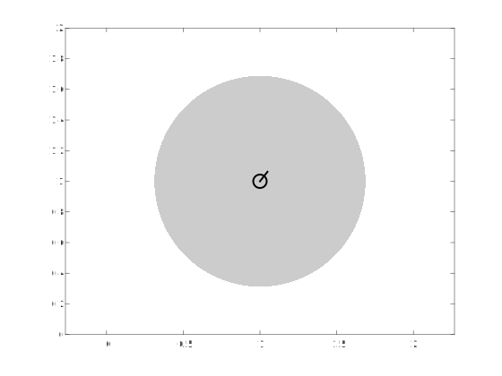

# plotRobot

`plotRobot` is a MATLAB script that plots a circular marker with a 'nose', denoting the heading and x,y coordinates of a robot. The length of the 'nose' is automatically calculated to fit the size of the circular marker. A callback function is added to the parent figure properties to keep resizing the marker for all previous robots drawn with `plotRobot` on the same axes, given that `plotRobot` was not used to plot on another axes inbetween.

## Installation

1. Extract the ZIP file (or clone the git repository).
2. Add the `src/` folder to your path in MATLAB
   - using the "Set Path" dialog
   - by running `addpath` from the command window or `startup` script.

## Usage

```matlab
pose = [1 1 pi/4]
covariance = 0.2*eye(3)
plotRobot(pose, covariance)
axis equal
```



The function accepts multiple options, check them by inspecting the help.

```matlab
help plotRobot
```
